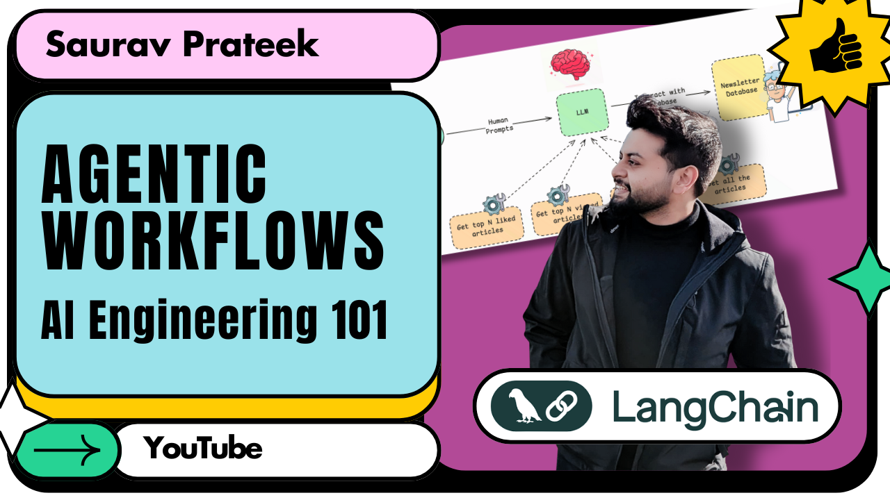

# AI Engineering 101 - Agentic Workflow collections [YouTube]

The repo holds the collection of Agentic workflows as a part of my [Youtube channel's](https://www.youtube.com/@saurav_prateek_) playlist "**AI Engineering 101**".

Visit the Playlist [here](https://www.youtube.com/playlist?list=PL3tZ_eA1QJswSQrpDveVkIH-wElOmsxQT).

### Episode 1: Building a Referral Outreach Agentic Workflow in LangChain | LangGraph, Python (from scratch)

- **Link**: [Watch here](https://youtu.be/FjUNgQw4HZ8?si=_KhshHtjh3XxOAxV)
- **Description**: We're diving deep into agentic workflows to create a smart system that crafts highly personalized referral messages. Our agent will intelligently analyze a candidate's experience and skills, then tailor a unique message designed to resonate with the recipient and maximize your chances of getting noticed for that dream role.
- **Code**: [View Source Code](https://github.com/SauravP97/agentic-workflows/tree/main/outreach-agent)

### Episode 2: Optimizing your Agentic workflow with Parallel Execution in LangGraph | LangChain, Python

- **Link**: [Watch here](https://youtu.be/mMzAbhnOgXQ?si=ul5oHiu01yUlPfRn)
- **Description**: We dive deep into optimizing LangGraph applications by leveraging parallel execution. Learn how to build more efficient and responsive AI agents using LangChain and Python, dramatically speeding up complex multi-step processes. Say goodbye to sequential bottlenecks and hello to lightning-fast performance!
- **Code**: [View Source Code](https://github.com/SauravP97/agentic-workflows/tree/main/parallel-execution)

### Episode 3: Tool Calling - Make LLMs talk to Database, APIs and Web | Langchain | Python

- **Link**: [Watch here](https://youtu.be/Occy4R56hig?si=msX2C7GA4RfefZoQ)
- **Description**:  We dive deep into Tool Calling with LangChain, a game-changing technique that allows LLMs to perform actions, fetch real-time data, and seamlessly integrate with external systems.
- **Code**: [View Source Code](https://github.com/SauravP97/agentic-workflows/tree/main/tool-calls)

### Episode 4: Add Memory to your AI Agents | Context Management for LLMs | LangChain

- **Link**: [Watch here](https://youtu.be/T2L9eC8ij7w?si=1u4RANWvgCkl2hnr)
- **Description**:  This video explores a crucial concept: adding memory to your LangChain agents. Let’s walk through the process step-by-step, transforming your stateless agents into intelligent conversationalists who remember context and build upon past interactions. Get ready to build more sophisticated and human-like AI. 
- **Code**: [View Source Code](https://github.com/SauravP97/AI-Engineering-101/tree/main/memory-agent)

More episodes coming up...
Stay tuned, and subscribe to the [channel](https://www.youtube.com/@saurav_prateek_) :)