# AI Engineering 101 - Agentic Workflow collections [YouTube] :headphones:

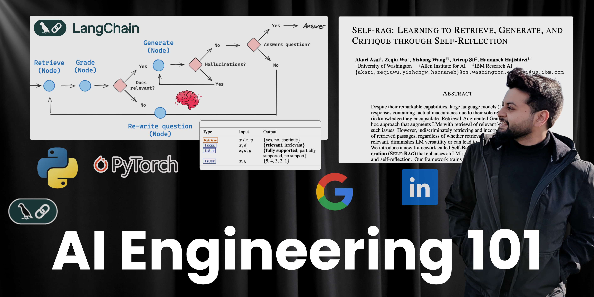

The repo holds the collection of Agentic workflows as a part of my [Youtube channel's](https://www.youtube.com/@saurav_prateek_) playlist "**AI Engineering 101**".

Visit the Playlist [here](https://www.youtube.com/playlist?list=PL3tZ_eA1QJswSQrpDveVkIH-wElOmsxQT).

### Table of Contents

|S.No| Episodes                                                              | Link         | Duration (h:m:s) |
|:---| :-------------------------------------------------------------------- | :------:     | -------: |
|1.  | :pager: Building a Referral Outreach Agentic Workflow in LangChain            |  [Watch](https://youtu.be/FjUNgQw4HZ8?si=_KhshHtjh3XxOAxV)   | 29:08    |
|2.  | :rocket: Optimizing your Agentic workflow with Parallel Execution in LangGraph |  [Watch](https://youtu.be/mMzAbhnOgXQ?si=ul5oHiu01yUlPfRn)   | 32:12    |
|3.  | :wrench: Tool Calling - Make LLMs talk to Database, APIs and Web               |  [Watch](https://youtu.be/Occy4R56hig?si=msX2C7GA4RfefZoQ)   | 24:45    |
|4.  | :floppy_disk: Add Memory to your AI Agents, Context Management for LLMs             |  [Watch](https://youtu.be/T2L9eC8ij7w?si=1u4RANWvgCkl2hnr)   | 28:17    |
|5.  | :dart: Debugging your Agentic Workflows, Threads & Checkpoints               |  [Watch](https://youtu.be/Iu6JB8SuS3U?si=Q09ra_fd7GQofg7B)   | 27:37    |
|6.  | :pencil: Building an Agentic workflow that creates personalized Linkedin Post (Few-shot Prompting)               |  [Watch](https://youtu.be/3knBxkLjDMk)   | 34:10    |
|7.  | :mushroom: Building a Text to SQL Agent for handling complex database queries, LangChain, Python               |  [Watch](https://youtu.be/YXDA4kfW_Dg)   | 38:43    |
|8.  | :gift: Building a Self-RAG, Making your Agentic workflows critique with Self-Reflection               |  [Watch](https://youtu.be/H9zMp5wzQjc)   | 1:02:41    |
|9.  | :blossom: Agent to analyze Google Careers and your Resume to recommend open Roles and Preparation strategies |  [Watch](https://youtu.be/AuOkG3iQFog)   | 50:34    |
|10.  | :golf: Building a Corrective RAG - Integrating Web Search as a fallback knowledge base |  [Watch](https://youtu.be/vAJqCDaU9Oc)   | 46:34    |
|11.  | :raising_hand: Human in the Loop - Interrupting your Agentic Workflow for user input |  [Watch](https://youtu.be/2Ox8Plu-uKw)   | 26:43    |
|12.  | :telescope: Vector Embeddings for Semantic Analysis - Introducing Google Gemini Embedding Models |  [Watch](https://youtu.be/r1cZWdjKK7A?si)   | 28:33    |

---

### :pushpin: Episode 1: Building a Referral Outreach Agentic Workflow in LangChain | LangGraph, Python (from scratch)

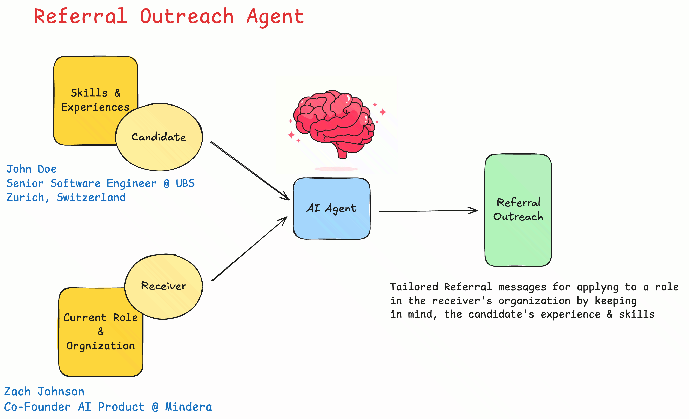

- **Link**: [Watch here](https://youtu.be/FjUNgQw4HZ8?si=_KhshHtjh3XxOAxV)
- **Description**: We're diving deep into agentic workflows to create a smart system that crafts highly personalized referral messages. Our agent will intelligently analyze a candidate's experience and skills, then tailor a unique message designed to resonate with the recipient and maximize your chances of getting noticed for that dream role.
- **Code**: [View Source Code](https://github.com/SauravP97/agentic-workflows/tree/main/outreach-agent)
 
---

### :pushpin: Episode 2: Optimizing your Agentic workflow with Parallel Execution in LangGraph | LangChain, Python

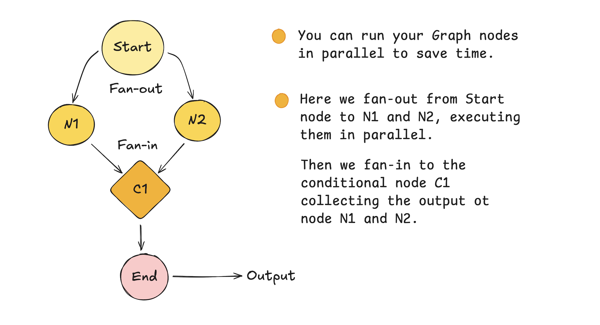

- **Link**: [Watch here](https://youtu.be/mMzAbhnOgXQ?si=ul5oHiu01yUlPfRn)
- **Description**: We dive deep into optimizing LangGraph applications by leveraging parallel execution. Learn how to build more efficient and responsive AI agents using LangChain and Python, dramatically speeding up complex multi-step processes. Say goodbye to sequential bottlenecks and hello to lightning-fast performance!
- **Code**: [View Source Code](https://github.com/SauravP97/agentic-workflows/tree/main/parallel-execution)

---

### :pushpin: Episode 3: Tool Calling - Make LLMs talk to Database, APIs and Web | Langchain | Python

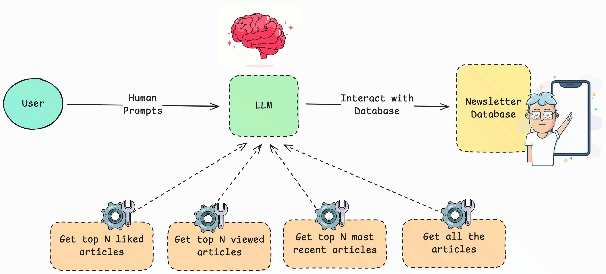

- **Link**: [Watch here](https://youtu.be/Occy4R56hig?si=msX2C7GA4RfefZoQ)
- **Description**:  We dive deep into Tool Calling with LangChain, a game-changing technique that allows LLMs to perform actions, fetch real-time data, and seamlessly integrate with external systems.
- **Code**: [View Source Code](https://github.com/SauravP97/agentic-workflows/tree/main/tool-calls)

---

### :pushpin: Episode 4: Add Memory to your AI Agents | Context Management for LLMs | LangChain

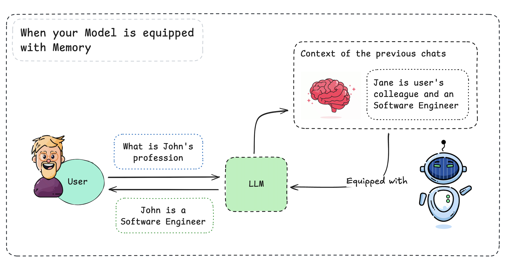

- **Link**: [Watch here](https://youtu.be/T2L9eC8ij7w?si=1u4RANWvgCkl2hnr)
- **Description**:  This video explores a crucial concept: adding memory to your LangChain agents. Let’s walk through the process step-by-step, transforming your stateless agents into intelligent conversationalists who remember context and build upon past interactions. Get ready to build more sophisticated and human-like AI. 
- **Code**: [View Source Code](https://github.com/SauravP97/AI-Engineering-101/tree/main/memory-agent)

---

### :pushpin: Episode 5: Debugging your Agentic Workflows | Threads & Checkpoints | LangChain

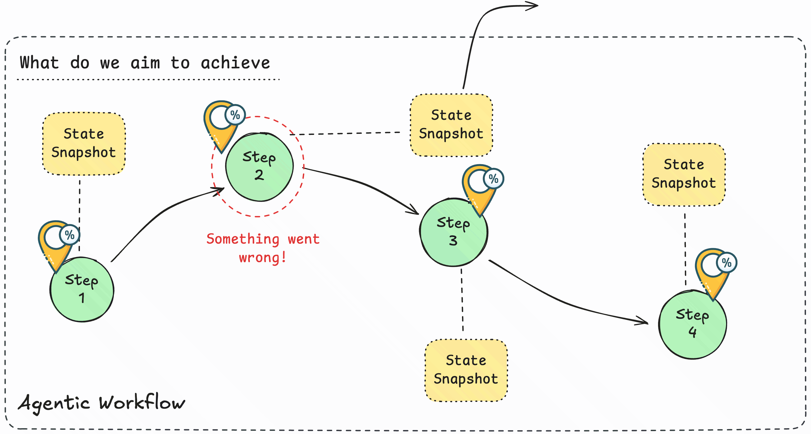

- **Link**: [Watch here](https://youtu.be/Iu6JB8SuS3U?si=Q09ra_fd7GQofg7B)
- **Description**:  Unlock the secrets to seamless LangChain agent debugging! In this video, we'll tackle one of the biggest challenges in building sophisticated AI applications. Discover how LangChain's Threads and Checkpoints provide an invaluable framework for understanding and fixing even the most elusive bugs in your agent's reasoning.
- **Code**: [View Source Code](https://github.com/SauravP97/AI-Engineering-101/tree/main/debugging-workflow)

---

### :pushpin: Episode 6: Building an Agentic workflow that creates personalized Linkedin Post | Few Shot Prompting | LangChain

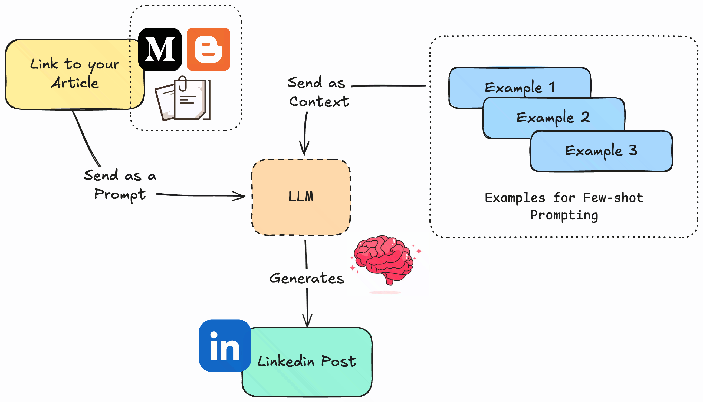

- **Link**: [Watch here](https://youtu.be/3knBxkLjDMk)
- **Description**:  In this video we will build an Agentic Workflow that creates personalized Linkedin post content from an Article, Research paper or a document which a user might want to share on social media like Twitter (X) or Linkedin as a post.

We utilize the concept of Few-Shot Prompting where we provide our agent with a few examples of the Post and Content to guide its performance. This method is particularly useful in scenarios where extensive training data is unavailable.

- **Code**: [View Source Code](https://github.com/SauravP97/AI-Engineering-101/tree/main/few-shot-prompting)

---

### :pushpin: Episode 7: Building a Text to SQL Agent for handling complex database queries | LangChain | Python

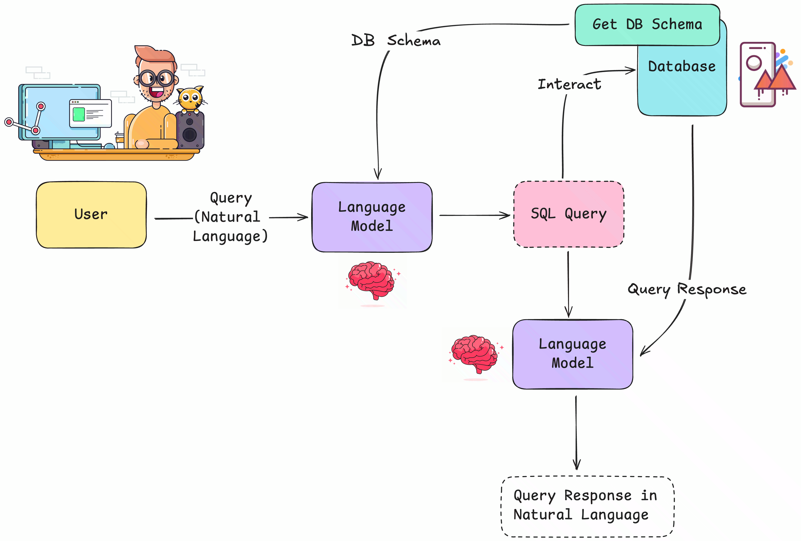

- **Link**: [Watch here](https://youtu.be/YXDA4kfW_Dg)
- **Description**:  This video is an in-depth tutorial on building a Text-to-SQL Agent using LangChain in Python. 

In this video, we'll go beyond simple queries and show you how to create a powerful AI agent that can understand complex, natural language questions and convert them into accurate SQL. You'll learn to handle everything from simple SELECT statements to advanced joins and subqueries.

- **Code**: [View Source Code](https://github.com/SauravP97/AI-Engineering-101/tree/main/text-to-sql)

---

### :pushpin: Episode 8: Building a Self-RAG | Making your Agentic workflows critique through Self-Reflection | LangChain

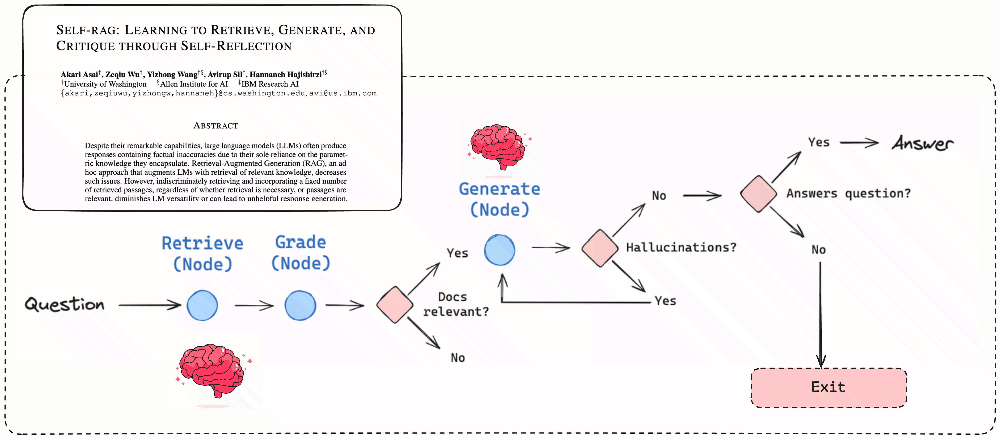

- **Link**: [Watch here](https://youtu.be/H9zMp5wzQjc)
- **Description**:  In this video, we dive deep into Self-Reflective Retrieval-Augmented Generation (Self-RAG) workflow, an advanced RAG technique that enhances the factuality and quality of Large Language Models (LLMs). Unlike traditional RAG, which retrieves documents for every query, a Self-RAG system can reflect on its own generations and decide whether or not to retrieve external information.

- **Code**: [View Source Code](https://github.com/SauravP97/AI-Engineering-101/tree/main/self-rag)

---

### :pushpin: Episode 9: Agent to analyze Google Careers and your Resume to recommend open Roles and Preparation strategies | LangChain | Python

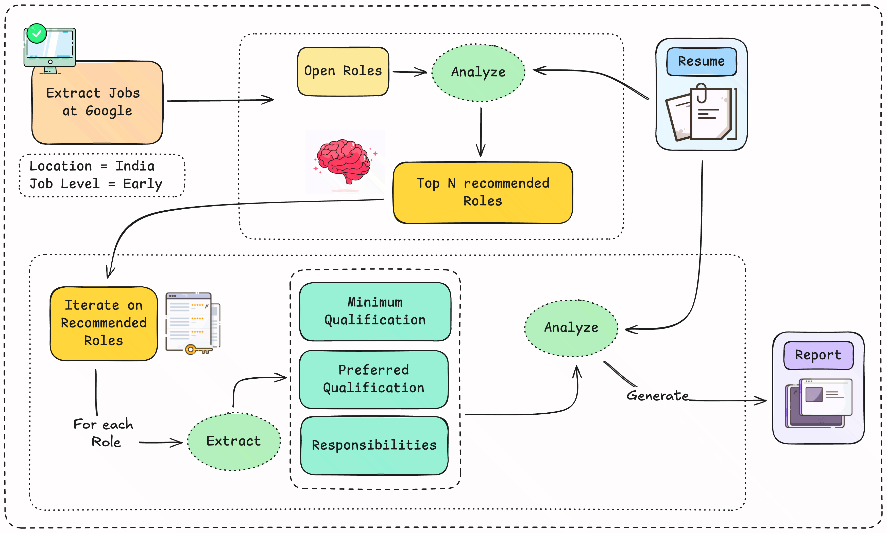

- **Link**: [Watch here](https://youtu.be/AuOkG3iQFog)
- **Description**:  In this video, we'll build a powerful AI agent that helps you land your dream job at Google! 🚀 Using LangChain and Python, this agent analyzes open roles on Google Careers and cross-references them with your resume.
We will build an Agent that can analyze your resume and open positions on the Google Careers page to recommend most relevant roles and then analyze those roles against your resume to prepare a detailed Report  documenting your strengths, gaps and preparation strategies.

- **Code**: [View Source Code](https://github.com/SauravP97/AI-Engineering-101/tree/main/google-job-search-agent)

---

### :pushpin: Episode 10: Building a Corrective RAG | Integrating Web Search as a fallback knowledge base | LangChain | Python

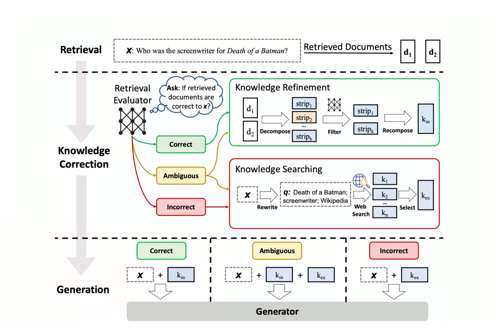

- **Link**: [Watch here](https://youtu.be/vAJqCDaU9Oc)
- **Description**:  In this video, we'll build a Corrective Retrieval Augmented Generation (C-RAG) workflow which integrates Web Search as a fallback knowledge base. We will go through the C-RAG paper which introduces the Retriever and a Generator module.
We will build a Retrieval module that retrieves essential documents and performs knowledge refinement and a Generator module that generates answers for the question and the knowledge base.

- **Code**: [View Source Code](https://github.com/SauravP97/AI-Engineering-101/tree/main/corrective-rag)

---

### :pushpin: Episode 11: Human in the Loop | Interrupting your Agentic Workflow for user input | LangChain | Python

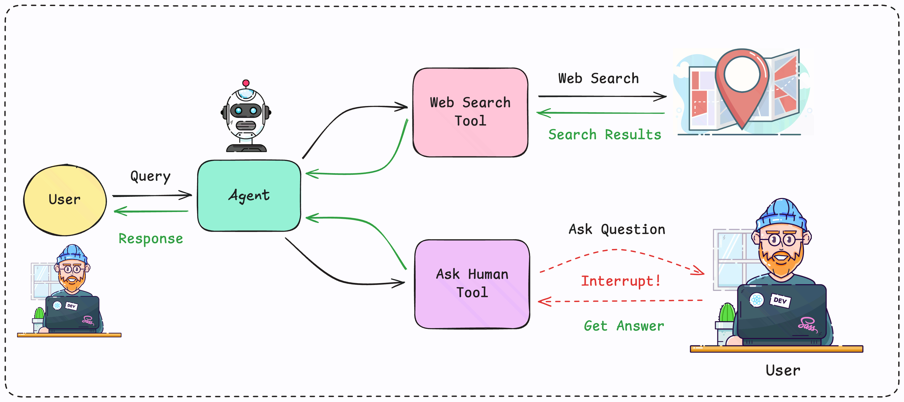

- **Link**: [Watch here](https://youtu.be/2Ox8Plu-uKw)
- **Description**:   In this video, we dive into the fascinating world of Human-in-the-Loop (HIL) and show you how to seamlessly integrate human intervention into your AI agents using LangChain and Python. We'll explain this crucial concept and why it's a game-changer for building reliable and robust AI applications. Discover the power of pausing your autonomous agents to add real-time human expertise, validation, and course correction.

- **Code**: [View Source Code](https://github.com/SauravP97/AI-Engineering-101/tree/main/human-in-loop)

---

### :pushpin: Episode 12: Vector Embeddings for Semantic Analysis | Introducing Google Gemini Embedding Models

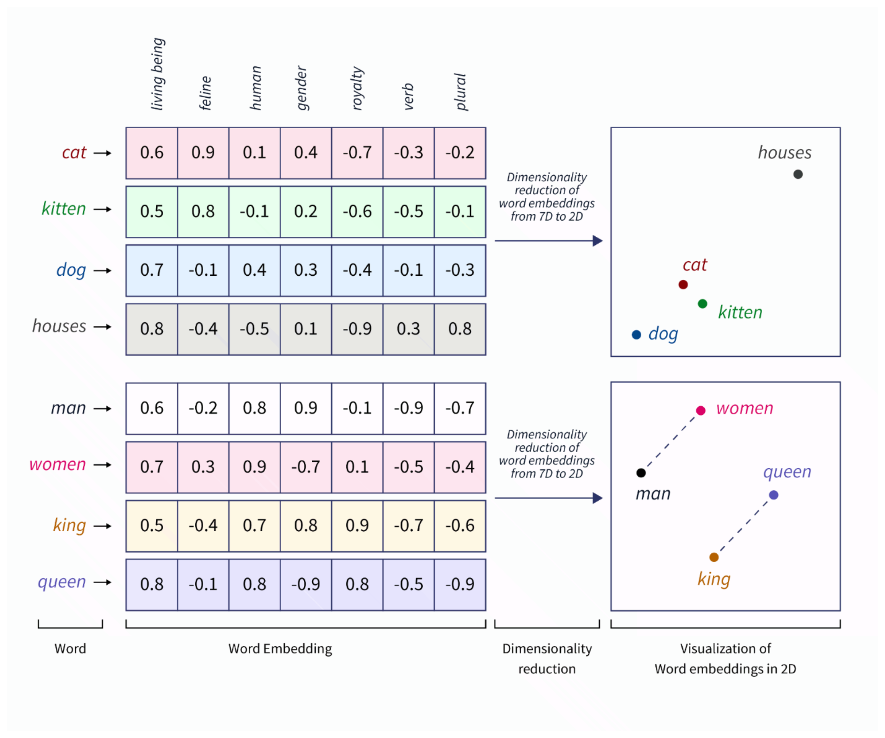

- **Link**: [Watch here](https://youtu.be/r1cZWdjKK7A?si)
- **Description**:   In this video, we dive deep into the world of vector embeddings with this comprehensive guide! We'll demystify how these numerical representations of text and data unlock powerful applications like Semantic Search, Classification and Clustering.

- **Code**: [View Source Code](https://github.com/SauravP97/AI-Engineering-101/tree/main/vector-embeddings)

---

More episodes coming up...
Stay tuned, and subscribe to the [channel](https://www.youtube.com/@saurav_prateek_) :smiley: